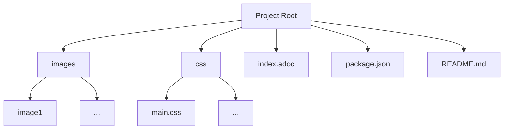

Hey there, fellow tech enthusiasts! Let's get real – I've crafted more PowerPoint presentations than I've sipped cups of coffee (and that's truly saying something). And, oh boy, have I waltzed the AI tango, crossing my fingers that those flashy, paid tools would dance to my tune. But, alas, they left me high and dry, akin to a server without Wi-Fi.

You might be pondering, "Hey, did you just not woo the AI gods enough?" Well, let me spill the beans – I brought my A-game. But, as fate would have it, my AI courtship ended in a solo breakup.

So, there I stood, teetering on the precipice of embracing the time-honored art of creating presentations (yes, the software we all know). But then, a tech wizard leaned in and whispered about [RevealJS](https://revealjs.com/). It was like stumbling upon a treasure trove in my very own backyard. And believe me, the [results it churned out](https://beingtechnicalwriter.com/api.languages.github.io/) were nothing short of spectacular.

## The Inspiration
It all started with a spark of curiosity about API documentation languages like JSON and XML. These languages play a vital role in the tech landscape, connecting various applications and systems. I wanted to demystify these languages and share my insights with the community. That's when the idea of creating a presentation struck me.

## Meet RevealJS - The Presentation Wizard
After a long research, I stumbled upon RevealJS, a powerful framework that lets you create stunning presentations with HTML, CSS, and Markdown. What caught my attention was its ability to generate interactive and visually appealing slideshows. Plus, it supports Markdown - a language I'm familiar with. So, armed with the tools and enthusiasm, I dove into the creation process.

### Crafting the Presentation
Here is my project structure:

**images**
The [images](https://github.com/gautriv/api.languages.github.io/tree/main/images) directory is a treasure trove of visual delights. It's the go-to place where all the images used in our presentation find their cozy spot.

**css**
Ah, the [css](https://github.com/gautriv/api.languages.github.io/tree/main/css) directory – the fashionista of our presentation! Nestled within is a file that holds the power to transform the appearance of our RevealJS slides. Meet `main.css`, the sartorial genius that takes control of RevealJS styles and turns them into something uniquely ours.

**index.adoc**
I organized everything in an [`index.adoc`](https://github.com/gautriv/api.languages.github.io/blob/main/index.adoc) file, using Asciidoctor - a text processor that converts AsciiDoc files to various formats, including HTML. This content would serve as the foundation of my presentation. 

Within this magical file, I set attributes like the author's name (:author: Gaurav Trivedi), chose the revealjs backend, and even summoned custom CSS (:customcss: main.css) to give my presentation a unique style. But that was just the tip of the iceberg.

And oh, animations! I sprinkled the magic of [%auto-animate] on my slides. From code snippets to explanations, the auto-animate feature seamlessly transitioned elements with the grace of a ballet dancer, all thanks to auto-animate-easing="ease-in-out".

**package.json**

The [`package.json`](https://github.com/gautriv/api.languages.github.io/blob/main/package.json) file was my next stop. Here, I defined the project's details, dependencies, and scripts. It's like the mastermind behind the scenes, orchestrating the magic. I included dependencies such as @asciidoctor/reveal.js for RevealJS integration, asciidoctor-kroki for embedding diagrams, and more.  The magic spell lay in the scripts section of the package.json file. Running the prepare script executed the Asciidoctor command, transforming my AsciiDoc content into a dazzling RevealJS presentation. But that's not all - the script also handled copying the images and CSS to the appropriate directories in the public folder. This ensured that all the necessary assets were ready for the grand reveal.

## The Local Output: Exploring Your Creation Up Close
Before we unleash your presentation masterpiece, you need to make sure you've got a few things ready. Here's the checklist:

1. **[Node Package Manager (npm)](https://nodejs.org/en)**: If you're not already best pals with npm, it's time to become acquainted. Make sure you have it installed on your machine. To check, simply run `node --version` and `npm --version` in your command line. If they show up, you're good to go. If not, it's time to invite npm over.

Alright, let's get down to business. First, navigate to your project directory in the command line. This is where the magic will happen. Once you're there, `run npm install`. You might be wondering why we're doing this. Well, since you've got a package.json file waving its digital wand around, running this command will create a `package-lock.json` file. It's like setting up the stage for your presentation's grand performance.

With your digital stage all set, it's time for the big reveal. Drumroll, please. To see your presentation's local output in all its glory, `run npm run prepare`. This command will work its behind-the-scenes wizardry, transforming your AsciiDoc content, attributes, and animations into a stunning RevealJS presentation.

With this your repository strcuture would look something like this:

----
Project Root
│
├─ images
│  ├─ image1
│  └─ ...
|
├─ css
│  ├─ main.css
│  └─ ...
|
├─ public
│  ├─ index.html
│  └─ ...
|
├─ index.adoc
│
├─ package-lock.json
|
├─ package.json
│
└─ README.md

----
## Publish to GitHub
The journey didn't end with the presentation creation. I wanted to share my creation with the world. Thanks to the power of GitHub, I pushed all my content to a repository. To automate the publishing process, I turned to GitHub Actions.

I crafted a [`publish.yml`](https://github.com/gautriv/api.languages.github.io/blob/main/.github/workflows/publish.yml) file, specifying the workflow details. This file told GitHub how to build and deploy my presentation whenever changes were pushed to the repository. It's like having a dedicated assistant ensuring your presentation is always ready to shine.

After this my repository strcuture looked something like this:

---
Project Root
│─ .github
│  ├─ workflows
│   |─ publish.yml
|
├─ images
│  ├─ image1
│  └─ ...
|
├─ css
│  ├─ main.css
│  └─ ...
|
├─ public
│  ├─ index.html
│  └─ ...
|
├─ .gitignore
|
├─ index.adoc
│
├─ package-lock.json
|
├─ package.json
│
└─ README.md
---

## The Final Act - Showtime!
And there it was, [my masterpiece](https://beingtechnicalwriter.com/api.languages.github.io/) - a captivating RevealJS presentation about API documentation languages. The effort was worth it when I saw the interactive slides, smoothly transitioning between sections, with diagrams beautifully embedded via Kroki.

. To access the presentation, see [API DOCUMENTATION LANGUAGES A DEEP DIVE INTO JSON AND XML](https://beingtechnicalwriter.com/api.languages.github.io/)

. To access the source repository, see [api.languages.github.io](https://github.com/gautriv/api.languages.github.io)

**Wrapping Up**
My journey with RevealJS was a rollercoaster of excitement, learning, and creation. It's incredible how technology can transform ideas into interactive experiences. If you're eager to share your knowledge or captivate your audience, RevealJS is a fantastic tool to explore. So, grab your content, let your creativity flow, and let RevealJS weave its magic!

Stay curious, keep learning, and happy presenting!